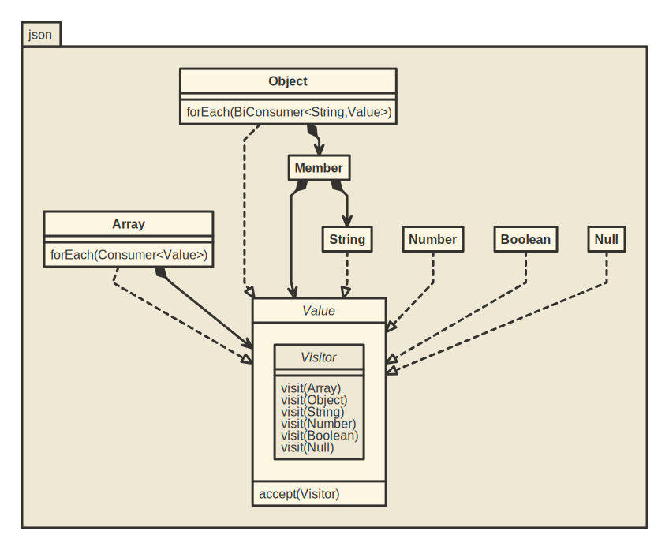

JSON Using Java ~~17 Preview Features~~ 21
==========================================

🤔 What if one wanted to build from scratch a new JSON library using new Java features like:
- sealed interfaces
- type switches

🙂 There it is

😎 (2023-09-28) Update: this is now working out of the box on JDK ≥ 21

### TL; DR



**Sealed interfaces** and **type switches** allow kinda _union type_ in Java world:

```typescript
let value: <Array | Boolean | Null | Number | Object | String>
```
... becomes ...

```java
public sealed interface Value
  permits Array, Boolean, Null, Number, Object, String {...}
...
Value value;
```
... with same kind of type safety:

- `value` can be any of the permitted types, but nothing else.
- any new subtype of `Value` must be handled properly in all switches.

#### Example 1

One can iterate over all the values of a given array and deal with each one with a `switch` statement like this:

```java
json.Array array = ...
array.forEach(v -> switch (v) {
  case Array   array -> doingStufWithArray  (array);
  case Boolean  bool -> doingStufWithBoolean(bool);
  case Null      nil -> doingStufWithNull   (nil);
  case Number number -> doingStufWithNumber (number);
  case Object object -> doingStufWithObject (object);
  case String string -> doingStufWithString (string);
});
```

#### Example 2

One can iterate over all the member of a given object and deal with each one with a `switch` statement like this:

```java
json.Object object = ...
object.forEach((k, v) -> switch (v) {
  case Array   array -> doingStufWithNamedArray  (k,array);
  case Boolean  bool -> doingStufWithNamedBoolean(k,bool);
  case Null      nil -> doingStufWithNamedNull   (k,nil);
  case Number number -> doingStufWithNamedNumber (k,number);
  case Object object -> doingStufWithNamedObject (k,object);
  case String string -> doingStufWithNamedString (k,string);
});
```

#### Example 3

The `Value` interface might define the default `#accept(Visitor)` method as follows:

```java
public sealed interface Value
  permits Array, Boolean, Null, Number, Object, String {
  ...
  default void accept(Visitor visitor) {
    switch (this) {
      case Array   array -> visitor.visit(array);
      case Boolean  bool -> visitor.visit(bool);
      case Null      nil -> visitor.visit(nil);
      case Number number -> visitor.visit(number);
      case Object object -> visitor.visit(object);
      case String string -> visitor.visit(string);
    }
  }
  ...
}
```

### Thanks

Inspired by [Francois Teychene](https://github.com/fteychene/adt-java17-presentation)'s tools-in-action on [Algebraic Data Types (ADT)](https://cfp.devoxx.fr/2022/talk/UBH-4536/Type_algebrique_de_donnees_en_Java_17) at DevoxxFR 2022.

### DISCLAIMER

⚠ Do not use in production ⚠

😉
